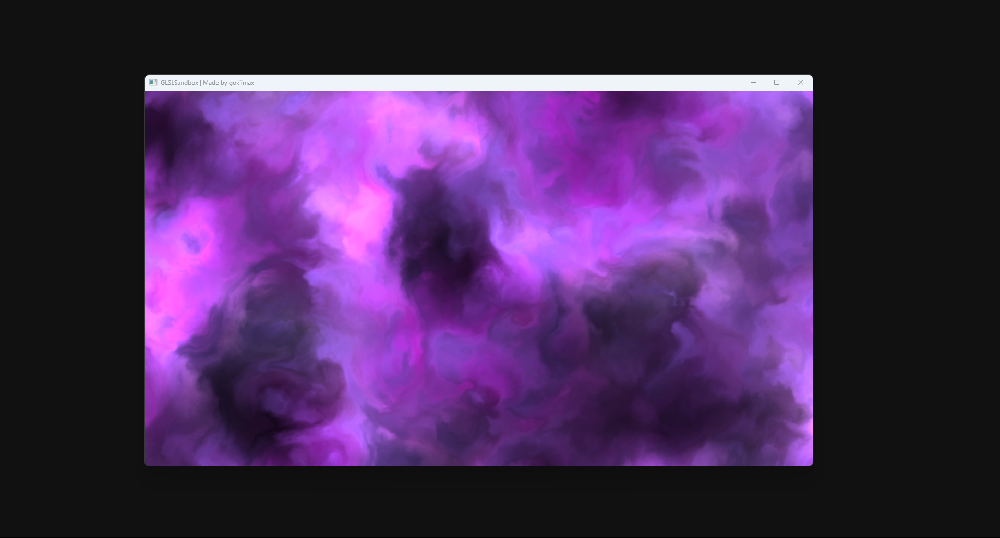
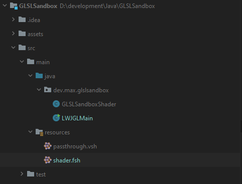
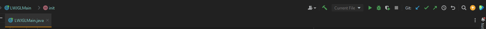

# GLSLSandbox
Simple GLSLSandbox for shader testing written in Java

## ⚙️ Installation

### 1. Clone the repository
```bash
https://github.com/gokiimax/GLSLSandbox.git
```

### 2. Open the project with your IDE for Example [Intellij](https://www.youtube.com/watch?v=okgZ_0ZoRh4)


### 3. Change the shader
Go into resources and paste your shader code into shader.fsh


### 4. Start the Application
Open the LWJGLMain file and just click on the Start button on the top right corner


## 🐲 Nice Shaders
1. https://glslsandbox.com/e#65219.0
2. https://glslsandbox.com/e#99035.0
3. https://glslsandbox.com/e#98973.0
4. https://glslsandbox.com/e#98618.0